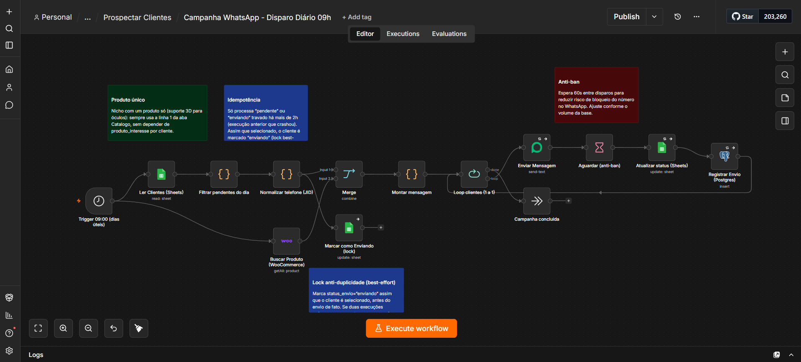
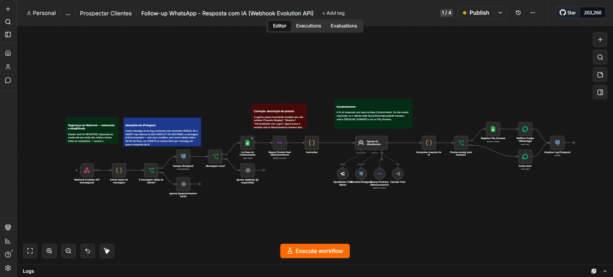

# 🤖 Sofia — Agente de Prospecção B2B via WhatsApp

## 📌 Visão Geral

Sistema de prospecção e atendimento automatizado via WhatsApp para e-commerce B2B, orquestrado em dois workflows n8n que trabalham em conjunto: uma campanha diária de abordagem fria e um agente de IA que conduz a conversa em tempo real.

## 🎯 O Problema

- Prospecção manual de leads é lenta, inconsistente e não escala.
- Responder cada lead em tempo real, consultando catálogo e frete atualizados, exige um agente sempre disponível.
- Disparos em massa no WhatsApp sem controle de ritmo geram bloqueio de número.
- Um agente de IA respondendo sem base real de produtos tende a "alucinar" (inventar itens que não existem).

## 💡 Solução Implementada

Dois workflows n8n complementares.

### 1️⃣ Campanha WhatsApp - Disparo Diário 09h

Dispara diariamente (dias úteis) abordagens para a base de leads qualificada, alternando entre variações de copy em teste A/B, com throttling anti-ban.

- Trigger agendado (09h, dias úteis)
- Leitura de clientes pendentes via Google Sheets
- Busca de produto real no WooCommerce (catálogo ao vivo, nicho com produto único)
- Lock anti-duplicidade (best-effort): marca `status_envio = "enviando"` assim que o cliente é selecionado, antes do envio de fato
- Espera de 60s entre disparos (anti-ban), ajustável conforme volume da base
- Loop de envio, atualização de status e registro em Postgres

### 2️⃣ Follow-up WhatsApp - Resposta com IA (Webhook Evolution API)

A Sofia, agente de IA com persona própria, responde às réplicas dos leads em tempo real.

- Webhook da Evolution API com segurança por header de autenticação
- Deduplicação por `message_id` no Postgres (`ON CONFLICT DO NOTHING`) — evita responder a mesma mensagem duas vezes em execuções concorrentes
- Filtro de mensagens de grupo, eco e mensagens sem texto
- Consulta ao catálogo ao vivo via API do WooCommerce — correção de alucinação: a IA só responde com produto real, nunca inventado
- Cálculo de frete real (PAC/SEDEX) via API do Melhor Envio
- Memória de conversa persistente em PostgreSQL/Supabase
- Escalonamento automático para atendimento humano (fila humana) em pedidos de desconto, reclamação ou solicitação explícita de atendimento humano — a IA nunca decide sozinha nesses casos

## 🛠️ Stack Tecnológica

n8n · Evolution API (WhatsApp) · Agentes de IA / OpenRouter · WooCommerce REST API · PostgreSQL/Supabase · Melhor Envio API · Google Sheets API · Prompt Engineering

## 🔒 Decisões de Engenharia

- **Idempotência:** dedupe por `message_id` com constraint UNIQUE no Postgres, evitando reprocessar a mesma mensagem em execuções concorrentes.
- **Lock otimista (best-effort):** evita disparo duplicado quando duas execuções da campanha diária se sobrepõem.
- **Anti-ban:** espera entre disparos para reduzir risco de bloqueio do número no WhatsApp.
- **Escalonamento humano:** casos sensíveis nunca são decididos sozinhos pela IA.

## 📊 Status

🟢 Em produção — os dois workflows estão publicados e ativos.

## 🔐 Nota

Este repositório documenta a arquitetura e as decisões de engenharia do projeto. O JSON de exportação dos workflows (que contém credenciais e IDs internos) não é versionado publicamente aqui.
